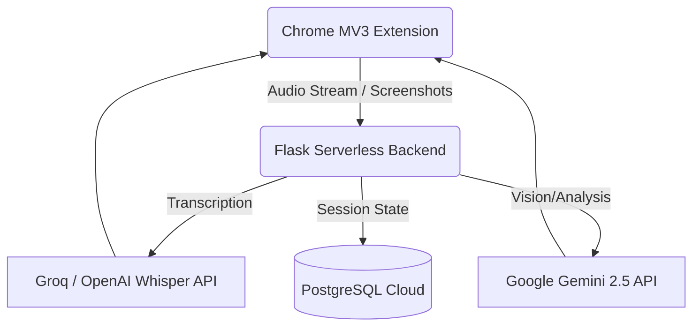

# ✍️ Scribe Assistant

**AI-powered live transcription, screen capture analysis, and real-time Q&A — right in your browser sidepanel.**

👉 **Live Extension Landing:** [scribe-extension.vercel.app](https://scribe-extension.vercel.app)

---

## ⚡ What it does

- 🎙️ **Live Transcription** — Captures audio from any browser tab or microphone and transcribes it in real-time using Groq Whisper, OpenAI Whisper, or Google Gemini.
- 📷 **Screen Capture & Paste** — Takes a screenshot of the active tab (or paste an image directly) and sends it to Gemini for visual analysis.
- 🤖 **AI Q&A** — Ask anything about the transcript or captures via the command bar.
- ✨ **Summarize** — One-click summaries in bullet points.
- 🕐 **Session History** — Every session saved locally and synced to the cloud.
- 👁️ **Stealth Mode** — Blurs the panel in high-pressure environments. Hover to reveal.

---

## 🏗️ Architecture

---

## 🕹️ Usage Guide

1. Open any tab with audio (YouTube, Zoom, Google Meet, etc.)
2. Click **Tab** to record tab audio, or **Mic** to record microphone.
3. The live transcript appears as audio is processed.
4. Hit **Summarize** for bullet-point notes, or type a question in the command bar.
5. Use **Capture** to screenshot the current tab and get visual AI analysis.

---

## ⚙️ Tech Stack Breakdown

- **Extension Core**: Vanilla JS, Chrome MV3, Web Audio API, `getDisplayMedia` + microphone capture
- **Backend API**: Python Flask on Vercel Edge/Serverless
- **Speech-to-Text**: Groq Whisper (`whisper-large-v3-turbo`) → OpenAI Whisper → Gemini multimodal (fallback chain)
- **Generative AI**: Google Gemini 2.5 Flash (default), 2.5 Pro, 2.0 Flash
- **Storage**: `chrome.storage.local` + PostgreSQL (`pg8000`)
- **UI System**: Deep space glassmorphism, Inter + JetBrains Mono, robust CSS animations